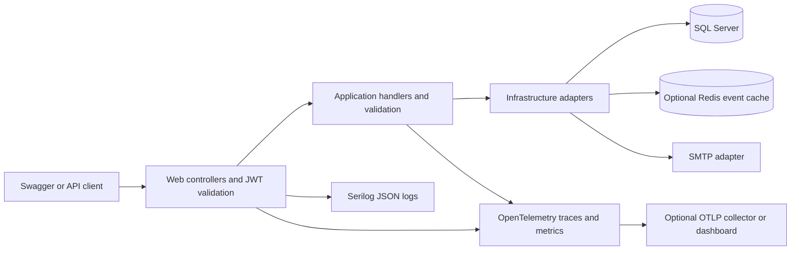

# EventPilot API — Project Handbook

**Edition:** API MVP, September 2026  
**Audience:** developers, reviewers, testers, and operators  
**Scope:** the backend API and Swagger workflows. Razor UI improvements, live SMTP delivery verification, and payment processing are outside this delivery.

## 1. Product purpose and MVP boundaries

EventPilot enables users to discover events, organize their own events, register for available seats, and review their registrations. The MVP is a single deployable ASP.NET Core application backed by SQL Server. Redis is an optional read optimization; it is not a system of record.

The primary workflow is:

1. Create an account and log in.
2. Enroll as an organizer, log in again, then create a published event or a draft to publish later.
3. Discover the event and retrieve its details.
4. Register as the authenticated attendee.
5. Inspect the registration in attendee history and the organizer's attendee list.
6. Cancel the registration to release the seat, if desired.

New accounts receive the User role. Any authenticated user may opt into the Organizer role through the self-service enrollment endpoint. Organizer operations require that role as well as ownership of the event being managed. No Admin role or administrative moderation workflow is introduced in this MVP.

Included capabilities are account registration, login/logout, password recovery, JWT authentication, profile updates, event management, discovery, pagination, ownership checks, registration history, capacity protection, validation, consistent API errors, structured logging, tracing, metrics, health checks, and automated tests.

Excluded capabilities include payment gateways, refunds, tickets, QR codes, waitlists, notification campaigns, social features, analytics dashboards for organizers, and microservices. An event price is descriptive; confirming a registration does not collect payment. Legacy payment-related fields in the registration entity are not an implemented payment workflow.

## 2. Architecture and dependencies

| Project | Responsibility | Main dependencies |
|---|---|---|
| `EventPilot.Domain` | Event and registration entities, lifecycle enums | No application or infrastructure dependency |
| `EventPilot.Application` | Commands, queries, handlers, DTOs, validators, business rules, abstractions | Domain, MediatR, FluentValidation |
| `EventPilot.Infrastructure` | SQL persistence, transactions, Identity, JWT generation, email adapter, Redis cache | Application, Domain, EF Core, SQL Server, Identity, StackExchange.Redis |
| `EventPilot.Web` | Controllers, authentication, dependency injection, serialization, exception handling, Swagger, operational endpoints | Application, Infrastructure, ASP.NET Core, Serilog, OpenTelemetry |
| `EventPilot.Tests` | xUnit unit, HTTP, SQL, concurrency, cache, and telemetry tests | Web and its referenced projects |

All projects target .NET 10. Package versions are declared in the project files. The application uses a monolithic deployment with logical architectural boundaries; it does not introduce distributed command processing.



Controllers dispatch MediatR requests. Validation runs before the operation handler. Application handlers identify users through `ICurrentUser`; clients cannot choose another attendee or organizer by submitting an ID. Infrastructure coordinates EF Core and SQL transactions. Event update rules are collected in `EventManagementRules`.

## 3. Domain model and database guarantees

### 3.1 Account

ASP.NET Core Identity manages integer account IDs, normalized usernames/emails, password hashes, lockout, roles, security stamps, and reset tokens. Email is also used as the username. Names and optional profile fields are stored on `ApplicationUser`.

Passwords are never stored in plaintext. The minimum policy is eight characters with uppercase, lowercase, a digit, and a non-alphanumeric character. Password inputs are capped at 256 characters.

### 3.2 Event

An event contains an ID, title, description, location, start/end timestamps, capacity, price, category, publication status, organizer ID, creation timestamp, deletion metadata, and a SQL Server `rowversion`.

Database constraints enforce positive capacity, nonnegative price, end after start, valid status/category ranges, organizer existence, and configured string/decimal limits. `Price` is `decimal(18,2)`. The database relationship prevents removal of an organizer account while its events reference it.

An EF global query filter excludes soft-deleted events from normal queries. Deletion sets `IsDeleted` and `DeletedAt`; it does not physically remove event history.

### 3.3 Registration

A registration contains the event and user IDs, registration timestamp, status, and email/name snapshots. A unique index on `(EventId, UserId)` prevents multiple rows for the same attendee and event.

Confirmed registrations consume seats. Cancelled registrations do not. Remaining seats are calculated as:

```text
RemainingSeats = Event.Capacity - ConfirmedRegistrationCount
```

Capacity means the configured seat limit, not a mutable remaining-seat counter. Rejoining reactivates the existing registration row and refreshes its registration timestamp and profile snapshots. This is a current registration history, not an immutable audit of every cancellation/rejoin action.

## 4. Business rules

| Area | Rule |
|---|---|
| Creation | Authenticated organizer; title 1–100, description 1–1000, location 1–50 characters; future start; end after start; capacity above zero; valid enum values; nonnegative price with at most two decimal places |
| Ownership | Only the owning organizer may update, delete, or list an event's attendees |
| Publication | Draft may become Published or Cancelled; Published may become Cancelled; Published cannot return to Draft; Cancelled cannot be reopened |
| Publishing/rescheduling | Publishing or changing the start of a published event requires a future start |
| Updates | Supply the current row version; capacity cannot fall below confirmed registrations |
| Discovery | Public listing contains published, non-deleted events whose end time is still in the future |
| Ongoing events | They remain discoverable until their end, but registration has already closed |
| Details | Published, non-deleted events have public details, including ended events; drafts/cancelled events are visible only to the owner |
| Registration | Authenticated self-registration only; event must exist, be published, not deleted, not started, and have a free seat |
| Duplicates | A second confirmed registration for the same user/event returns a conflict |
| Attendee cancellation | Cancels only the caller's registration; repeating cancellation is harmless; no additional cancellation deadline is enforced |
| Event cancellation/deletion | Cancels active registrations atomically while retaining history |
| History | A user sees only their own registrations, including cancelled registrations and soft-deleted events |

Creation accepts any valid event status, with Draft as the default. Creating an already-cancelled event is supported but usually not useful. Category and date filtering are not implemented; the MVP supports title search and exact price filtering.

## 5. Time and concurrency contracts

### 5.1 UTC timestamps

Every incoming API timestamp must include `Z` or an explicit offset. Inputs are normalized to UTC before validation and persistence. Examples representing the same instant are:

```text
2030-01-01T12:00:00Z
2030-01-01T14:00:00+02:00
2030-01-01T07:00:00-05:00
```

An ambiguous value such as `2030-01-01T12:00:00` returns HTTP 400. API output always uses UTC with `Z`. SQL `datetime2` stores UTC clock values; EF restores `DateTimeKind.Utc` after reads.

This change does not reinterpret or repair historical database timestamps. Existing values are treated as UTC. If a previous import stored local clock times, correct that data through a reviewed data migration using its known original timezone. Original timezones cannot be reconstructed from `datetime2` alone.

### 5.2 Optimistic event editing

Event responses include `rowVersion` as base64. Clients must submit that value in update requests. A stale version returns 409; retrieve the event again and reconcile the edit instead of blindly retrying the old payload.

Registrations also advance the event version. An organizer editing while attendees register may therefore receive a conflict. This protects capacity changes against concurrent seat allocation. DELETE checks ownership and database concurrency during execution, but does not accept a client row-version precondition.

### 5.3 Seat transactions

`RegistrationSeatStore` starts a fresh DbContext for each attempt, reads the event version, and performs a compare-and-swap update on the event row before changing registrations. It uses a READ COMMITTED transaction and a consistent event-first write order. SQL Server advances `rowversion` even when the capacity column is assigned its existing value.

After acquiring the event write lock, the store reads registration state and the confirmed count, applies the business decision, and saves atomically. Concurrent version changes and SQL deadlock victim errors retry at most five times with short randomized backoff. Exhaustion returns a retryable 409. Other errors are not blindly retried.

Organizer cancellation/deletion saves the event first and cancels its registrations in the same transaction. All registration mutations must continue through these coordinated paths. Direct SQL updates or new writers that bypass this protocol can break both capacity guarantees and version-based cache invalidation.

## 6. Authentication and account workflows

Successful login returns `data.accessToken`, `data.expiresAtUtc`, and `data.tokenType`. Supply the token using `Authorization: Bearer <token>`, or paste it into Swagger's Authorize dialog.

Every authenticated request verifies the JWT signature, issuer, audience, expiry, account existence, lockout, security stamp, and current role membership against SQL Server. Authentication results, roles, and security stamps are not cached. Logout rotates the stamp and revokes sessions on all devices. Password reset and organizer enrollment also rotate the stamp. No refresh-token mechanism is included.

Forgot-password returns the same generic message for known/unknown addresses and delivery failure. Reset links contain a base64url-encoded Identity token with a one-hour lifetime. Successful reset invalidates prior tokens and sessions. SMTP delivery is deferred from MVP verification; automated tests capture outgoing messages and exercise real Identity reset tokens without emailing users.

Authentication limits are per IP, per application instance, per minute: login 10, registration 5, forgot/reset combined 5. Identity also applies a five-failure account lockout for five minutes. Configure trusted proxy forwarding before using these IP limits behind a reverse proxy. Distributed rate limiting is a future deployment requirement if multiple API replicas are introduced.

### 6.1 Roles and authorization

Roles use ASP.NET Core Identity's existing `AspNetRoles` and `AspNetUserRoles` tables. `AppRoles` contains the canonical role names; there is no separate role enum or profile role column.

| Capability | Anonymous | User | User + Organizer |
|---|---|---|---|
| Discover public events and read published details | Yes | Yes | Yes |
| Register/cancel own attendance and read own history | No | Yes | Yes |
| Read/update own profile | No | Yes | Yes |
| Opt into Organizer | No | Yes | Already enrolled; no change |
| Create an event and list own events | No | No | Yes |
| Edit/delete events and list attendees | No | No | Own events only |
| Manage another organizer's events | No | No | No |

Both account-registration routes assign User on the server. Client-supplied role fields have no authority. Account creation and default role assignment share one SQL transaction, so a failed role assignment cannot leave a partially created account. Organizer enrollment adds Organizer while retaining User; Organizer is not a replacement for User.

The `CanManageEvents` policy requires an authenticated Organizer. It protects event creation, update, deletion, the organizer's event listing, and organizer attendee lists. Ownership checks in Application/Infrastructure remain mandatory. Public details/discovery still allow anonymous access, and attendee operations continue to require authentication without an Organizer role.

To enroll, call `POST /api/users/me/organizer` with a Bearer token and no body. The account is derived only from the trusted authentication context. Success returns:

```json
{
  "isSuccess": true,
  "message": "Organizer role granted. Log in again to use organizer features; previous sessions were revoked.",
  "data": { "roleChanged": true, "requiresLogin": true },
  "errors": []
}
```

Membership and security-stamp rotation commit atomically. The previous JWTs on every device are then invalid; log in again and replace the token in Swagger. Repeating enrollment with a fresh Organizer token returns `roleChanged: false` and `requiresLogin: false` without revoking that token. Concurrent enrollments cannot create duplicate memberships; a racing request may receive 401 or 409 and should refresh authentication/state.

JWT role claims are checked against current database membership on every authenticated request. A token with removed or otherwise stale roles returns 401, even if an Identity maintenance tool did not rotate the security stamp. A valid User token attempting an organizer operation returns 403. An Organizer attempting another owner's management operation also returns 403. Future role-changing services must rotate the security stamp atomically with their changes; there is no public arbitrary-role assignment or role-removal endpoint.

The `AddUserAndOrganizerRoles` data migration creates the two roles if absent, assigns User to existing accounts, and assigns Organizer to existing event owners, including owners of deleted events. It preserves unrelated roles and memberships and rotates security/concurrency stamps for accounts receiving new memberships. Apply migrations before serving the new version and have affected users log in again. Demo seeding assigns both roles to the ten organizers and User to the ninety attendees.

This backfill cannot be automatically reversed safely because memberships may predate the migration or change afterward. Its Down migration deliberately refuses destructive guessing. Use a reviewed data migration or a backup restore if rollback of role data is required.

## 7. API reference

Swagger UI: `/swagger`. OpenAPI document: `/swagger/v1/swagger.json`.

| Method and path | Access | Purpose |
|---|---|---|
| `POST /api/auth/register` | Public | Create account; 201 with account ID |
| `POST /api/users` | Public | Compatibility alias for registration |
| `POST /api/auth/login` | Public | Obtain JWT; 200 or 401 |
| `POST /api/auth/forgot-password` | Public | Request recovery email |
| `POST /api/auth/reset-password` | Public | Submit email, token, newPassword |
| `POST /api/auth/logout` | Authenticated | Revoke all account sessions |
| `GET /api/users/me` | Authenticated | Read own identity/profile summary |
| `PATCH /api/users/me` | Authenticated | Update names and/or phone number |
| `POST /api/users/me/organizer` | Authenticated | Opt into Organizer; log in again after a change |
| `GET /api/users/me/registrations` | Authenticated | Paginated own registration history |
| `GET /api/events` | Public | Active published discovery |
| `GET /api/events/mine` | Organizer | Own non-deleted events, all statuses/dates |
| `GET /api/events/{id}` | Public/owner | Details under visibility rules |
| `POST /api/events` | Organizer | Create an event owned by the caller |
| `PUT /api/events` | Organizer + owner | Update using body eventId and rowVersion |
| `DELETE /api/events/{id}` | Organizer + owner | Soft-delete and cancel active registrations |
| `POST /api/events/{eventId}/registrations` | Authenticated | Register self; no request body |
| `DELETE /api/events/{eventId}/registrations/me` | Authenticated | Cancel own registration |
| `GET /api/events/{eventId}/registrations` | Organizer + owner | Paginated attendee snapshots/statuses |
| `GET /health/live` | Public | Process liveness |
| `GET /health/ready` | Public | SQL readiness and optional cache status |

All paginated endpoints accept `pageNumber` (default 1) and `pageSize` (default 20, range 1–100). Event lists additionally accept `search` (trimmed title substring, maximum 100 characters) and `price` (exact price, including zero). Price filters share the event range/precision rules. Invalid pagination, excessive offsets, and invalid prices return 400.

Event lists sort by start descending, then ID. Registration lists sort by registration date descending, then ID. Pagination is offset-based; concurrent inserts can move records between pages. It does not promise a multi-request snapshot.

### 7.1 Request examples

Register an account:

```json
{
  "email": "organizer@example.com",
  "password": "ChooseYourOwnStrongPassword1!",
  "firstName": "Alex",
  "lastName": "Morgan"
}
```

Create an event using future dates appropriate to the execution date:

```json
{
  "ev": {
    "title": "Backend Engineering Meetup",
    "description": "A community discussion of API design.",
    "location": "Paris",
    "startAt": "2030-06-20T16:00:00Z",
    "endAt": "2030-06-20T18:00:00Z",
    "capacity": 30,
    "price": 0,
    "status": 1,
    "category": 0
  }
}
```

`status`: Draft=0, Published=1, Cancelled=2. Category values run from Technology=0 to Other=17; Swagger exposes the current enum schema. Registration statuses are Confirmed=0 and Cancelled=1; Pending=2 is a legacy/reserved enum value that the current registration API does not create. Registration statuses must not be confused with event statuses.

Update an event:

```json
{
  "eventId": "<event GUID>",
  "updateEventDto": {
    "title": "Backend Engineering Meetup",
    "description": "Updated event description.",
    "location": "Paris",
    "startAt": "2030-06-20T16:00:00Z",
    "endAt": "2030-06-20T18:00:00Z",
    "capacity": 40,
    "price": 0,
    "rowVersion": "<base64 value from the latest GET>",
    "status": 1,
    "category": 0
  }
}
```

This update replaces required event fields; it is not a partial PATCH. Omitting nullable status/category preserves them. Profile PATCH preserves null/omitted fields; provided names and phone numbers are validated. The profile summary currently returns ID, email, names, display name, and roles, not every stored profile field.

### 7.2 Responses and errors

Successful data responses use:

```json
{
  "isSuccess": true,
  "message": "Success",
  "data": {},
  "errors": []
}
```

Paged `data` contains `items`, `pageNumber`, `pageSize`, `totalCount`, `totalPages`, `hasPreviousPage`, and `hasNextPage`. Commands without data use the non-generic envelope. Error responses contain `isSuccess: false`, a safe message, and an errors array. Operational health endpoints deliberately return a small health-specific JSON object.

| Status | Meaning and client action |
|---|---|
| 400 | Invalid input; correct the request |
| 401 | Missing/invalid/revoked authentication; log in |
| 403 | Authenticated but not authorized for this event |
| 404 | Resource missing, deleted, or hidden by visibility rules |
| 409 | Duplicate registration, capacity/lifecycle conflict, stale version, or exhausted concurrency retry |
| 429 | Rate limit; respect `Retry-After` |
| 500 | Unexpected failure; retain `X-Trace-Id` for investigation |

Malformed JSON/model binding, API 404/405/415, authentication failures, and handled exceptions use consistent API error responses. Unexpected internal exception details are not exposed.

## 8. Redis caching design

Caching is disabled by default so Redis is not a prerequisite for running the API. Enable it with `Cache__Enabled=true` and `ConnectionStrings__Redis`.

Cached reads are event details, public event pages, and organizer event pages. These contain event information and seat summaries, not attendee identities. Account/JWT/reset data, profile data, attendee lists/history, ownership decisions, and registration writes are not cached. The event cache uses a dedicated keyed DI registration and does not replace the Razor session cache.

Before reusing a cached detail response, the repository checks current visibility and the committed event row version in SQL. Before reusing a cached page, it computes the authorized/filtered page's IDs, versions, total count, and pagination in SQL. Public date filtering therefore still runs on every request, even with warm cache entries.

Cache keys include a schema version and event version, or a hash of the page version signature. A write generates a new SQL row version, making older entries unreachable. Before publishing a cache miss result, the repository rechecks versions so a concurrent writer cannot populate an older key with newer data. Old entries expire; no wildcard deletion or cross-instance invalidation messages are needed.

This design reduces repeated full event projections and seat aggregation on hits. It intentionally retains SQL lookups for correctness; it is not a zero-database-query cache. Do not cache full HTTP responses independently without preserving these visibility and freshness checks.

Default TTL is 60 seconds (allowed 5–300). Cache calls have a 250 ms budget (allowed 50–2000). Redis failures, timeouts, and corrupt cache JSON fall back to SQL. A 30-second process-local circuit suppresses repeated cache attempts during outages. Request cancellation still propagates. Cache health reports Degraded while SQL continues serving traffic.

Use a dedicated Redis namespace/instance per environment. The local Compose service caps memory at 128 MB with `allkeys-lru`, disables persistence, and binds only to loopback. Production Redis should be privately reachable, access-controlled, and use TLS where appropriate. Never use cache availability as permission to bypass SQL business rules.

## 9. Logging, tracing, metrics, and health

### 9.1 Structured logs

Serilog implements the application's `ILogger` pipeline. JSON events are emitted to console and, by default, `logs/eventpilot-*.json`. Files roll daily or at 10 MB and retain up to 14 files. Set `Logging__FileEnabled=false` when the hosting platform collects console logs.

Request logs include route template, method, status, elapsed time, W3C trace ID, and span ID. `X-Trace-Id` correlates the API response with logs and traces. Application logs describe operation type, duration, internal user ID, and safe failure types. Cache failure logs omit keys and connection details.

Bodies, passwords, JWTs, reset tokens, raw query strings, unmatched paths, and SQL parameter values are excluded from application instrumentation. Framework categories that can emit sensitive exception contents are suppressed. Unexpected API failures record exception type and stack rather than raw messages; SQL/SMTP troubleshooting may require additional controlled diagnostics.

### 9.2 Tracing

The `EventPilot` ActivitySource records HTTP requests, MediatR operations, and event-cache operations. Incoming W3C trace context is propagated. Trace attributes use safe route templates and operation names; no automatic SQL text or HTTP payload instrumentation is enabled.

Set `Telemetry__OtlpEndpoint=http://localhost:4317` to export traces and metrics over OTLP/gRPC. An empty endpoint keeps external exporting disabled. An unavailable collector must not block business requests. The trace sampler follows the parent decision and samples root requests; tune sampling before high-volume production use.

### 9.3 Metrics

| Instrument | Meaning |
|---|---|
| `eventpilot.http.requests` | Request count by route, method, and status |
| `eventpilot.http.duration` | Request latency histogram, seconds |
| `eventpilot.cache.requests` | Cache hit, miss, and error counts |
| `eventpilot.registration.retries` | Seat-operation retries by concurrency/deadlock reason |
| .NET/ASP.NET runtime meters | Runtime, hosting, and Kestrel measurements |

Metric dimensions exclude user IDs, event IDs, search strings, and cache keys to keep cardinality bounded. Cache circuit bypasses are not counted as attempted cache operations.

### 9.4 Health and operational checks

`/health/live` checks that the application process responds. `/health/ready` checks a SQL event-table read and Redis connectivity when enabled. Healthy/Degraded returns 200; Unhealthy returns 503. Redis failure is degraded because the cache is optional. Responses expose dependency statuses, not exception messages, connection strings, or customer data. Readiness is not a substitute for applying migrations.

Recommended initial monitoring thresholds, to tune with real traffic:

- Investigate readiness failure lasting more than one minute.
- Alert on a sustained server-error rate above 1% over five minutes, with a minimum request-volume guard.
- Investigate sustained p95 API latency above one second.
- Warn on Redis degradation lasting five minutes; verify SQL load remains acceptable.
- Inspect rising registration retry counts and persistent 409 bursts for contention.
- Monitor disk usage/log retention and SQL backup failures at the host/database level.

These are operational recommendations, not remotely provisioned alerts. The included dashboard is a local telemetry viewer, not a durable monitoring or alerting backend.

## 10. Local setup and configuration

Prerequisites: .NET 10 SDK and SQL Server. Docker is optional for the supplied Redis/dashboard services. Configure secrets using .NET User Secrets in development and the deployment platform's secret store in production.

```powershell
dotnet restore EventPilot.slnx
$eventPilotKey = [Convert]::ToBase64String([System.Security.Cryptography.RandomNumberGenerator]::GetBytes(32))
dotnet user-secrets set "Jwt:Key" "$eventPilotKey" --project EventPilot.Web
dotnet user-secrets set "App:BaseUrl" "https://localhost:7287/" --project EventPilot.Web
dotnet user-secrets set "ConnectionStrings:DefaultConnection" "Server=.;Database=EventPilotDb;Integrated Security=true;TrustServerCertificate=true" --project EventPilot.Web
dotnet tool install dotnet-ef --tool-path .tools --version 10.0.2
.\.tools\dotnet-ef database update --project EventPilot.Infrastructure --startup-project EventPilot.Web
dotnet dev-certs https --trust
dotnet run --project EventPilot.Web --launch-profile https
```

If the local EF tool already exists, do not reinstall it. Open `https://localhost:7287/swagger`. The development HTTP profile uses port 5067 and overrides the base URL accordingly.

For optional Redis and telemetry on a machine with Docker:

```powershell
docker compose -f ops/compose.yml up -d
$env:Cache__Enabled = "true"
$env:ConnectionStrings__Redis = "localhost:6379"
$env:Telemetry__OtlpEndpoint = "http://localhost:4317"
dotnet run --project EventPilot.Web --launch-profile https
```

Open the local dashboard at `http://localhost:18888`. The Compose dashboard is loopback-only and permits anonymous local access. Do not expose those ports publicly. Serilog logs remain in console/files; the supplied OTLP integration exports traces and metrics, not logs.

| Setting | Purpose/default |
|---|---|
| `ConnectionStrings__DefaultConnection` | SQL Server connection |
| `Jwt__Key` | Required signing secret, at least 32 UTF-8 bytes |
| `Jwt__Issuer`, `Jwt__Audience` | Token issuer/audience; defaults EventPilot |
| `Jwt__ExpireMinutes` | 1–1440; default 60 |
| `App__BaseUrl` | Required trusted public HTTP(S) base URL for reset links/local API client |
| `Cache__Enabled` | false by default |
| `ConnectionStrings__Redis` | Required only when cache is enabled |
| `Cache__TtlSeconds` | 60 |
| `Cache__TimeoutMilliseconds` | 250 |
| `Telemetry__OtlpEndpoint` | Empty by default; OTLP/gRPC collector when supplied |
| `Logging__FileEnabled` | true |
| `Logging__MinimumLevel` | Information |
| `Email__SmtpHost`, `Email__SmtpPort` | SMTP host/port; deferred live verification |
| `Email__Username`, `Email__Password`, `Email__From` | SMTP credentials and sender |

Do not commit real signing keys, database passwords, SMTP credentials, or Redis credentials. Earlier credentials recorded in repository history must remain rotated. The local example connection trusts the SQL certificate for development; use verified TLS configuration for production.

The optional Development-only `--seed` command creates demo accounts/events in an empty database and exits. See README for the demo credentials. Never run demo seeding against production.

## 11. Testing and verification

```powershell
dotnet build EventPilot.slnx --no-restore
dotnet test EventPilot.Tests/EventPilot.Tests.csproj --no-restore
```

SQL tests create unique disposable `EventPilot_SeatTests_*` databases, apply real migrations, and delete only those databases. The default connection uses local SQL Server with integrated authentication. Override it with `EVENTPILOT_TEST_SQL`; the test account needs permission to create/drop its disposable databases.

Set `EVENTPILOT_TEST_REDIS` to run the real Redis integration test. Without it, that test is explicitly skipped. Provide a reachable Redis instance manually. Cache correctness/outage tests use controlled local cache adapters and run independently of a Redis installation.

Coverage includes validation, ownership, visibility, UTC/offset round trips, bounded price filters, ended-event discovery, unique registration, last-seat races, cancellation/rejoin, capacity updates, stale edits, actual SQL deadlock-victim recovery, schema constraints, real Identity authentication/reset/logout, rate limits, history, safe logging, versioned cache behavior, outage fallback, and trace correlation.

SMTP is replaced with a capture/failure sender. Passing tests do not prove delivery by an external mail provider. Local trace tests do not prove connectivity to a deployed collector.

## 12. Manual verification and releases

No GitHub Actions workflows are included. Run verification and release preparation manually from the repository root with the .NET 10 SDK, SQL Server, and a reachable Redis instance. Set EVENTPILOT_TEST_SQL and EVENTPILOT_TEST_REDIS for the test services; without the Redis setting, the real Redis integration test is skipped.

```powershell
dotnet restore EventPilot.slnx
dotnet build EventPilot.slnx -c Release --no-restore --warnaserror
dotnet test EventPilot.Tests/EventPilot.Tests.csproj -c Release --no-build --logger trx --results-directory TestResults
dotnet publish EventPilot.Web/EventPilot.Web.csproj -c Release --no-build -o artifacts/api
.\.tools\dotnet-ef migrations script --idempotent --project EventPilot.Infrastructure --startup-project EventPilot.Web --configuration Release --no-build --output artifacts/migrations.sql
```

Install the local dotnet-ef tool as described in the setup instructions before generating the migration script. Retain the test results, application artifact, migration script, and source revision together for each release.

1. Choose an IIS or Linux service/container host with SQL Server connectivity and prepare a staging environment.
2. Back up the target database, review the migration script, and apply it through a controlled migration step. The API does not automatically migrate on startup.
3. Inject configuration and secrets; configure HTTPS, trusted proxy headers, persistent Data Protection keys, log collection, and the OTLP destination.
4. Deploy the verified artifact to staging, then check /health/ready, public discovery, and an authenticated smoke workflow with dedicated test accounts.
5. After reviewing staging results, deploy the same artifact to production and repeat the smoke checks. Preserve the previous artifact for rollback.
6. If smoke checks fail, restore the previous application artifact only when compatible with the database schema. Database rollback requires a separately reviewed reverse migration or backup restore.

Persist ASP.NET Core Data Protection keys across restarts and share them if multiple instances are ever used; otherwise password-reset tokens can become invalid after redeployment. The current single-instance rate limiter and Razor session storage must also be revisited before scaling out. API seat correctness remains database-coordinated.

## 13. Operational troubleshooting

| Symptom | First checks |
|---|---|
| Startup refuses to run | Required JWT/base URL, cache option ranges, Redis connection setting when enabled |
| 401 after logout/reset | Expected security-stamp revocation; obtain a new token |
| 409 on event update | GET the latest row version; check capacity against confirmed count |
| Registration rejected despite free seats | Publication/deletion state and start-time cutoff |
| Redis degraded | Redis reachability/credentials/TLS; API should fall back to SQL |
| SQL readiness 503 | Connection, database availability, migrations, permissions |
| Missing telemetry | Configured OTLP/gRPC endpoint, network access, collector authentication/protocol |
| Generic 500 | Find logs using response `X-Trace-Id`; inspect safe exception type/stack |
| Recovery response succeeds but no email | Expected generic response; SMTP delivery is a separate operational concern |

## 14. MVP acceptance and remaining deployment work

The API implementation covers the agreed MVP workflows and the review corrections. Redis and telemetry integrations are optional, configurable additions. Razor UI redesign and live SMTP testing remain out of scope by agreement.

Code completion is distinct from a deployed production sign-off. Before public release, run the manual verification commands with a real Redis service, configure the chosen host and collector, apply migrations, verify backups and HTTPS, and run a deployment smoke test. Do not describe those external checks as completed merely because the local build passes.
